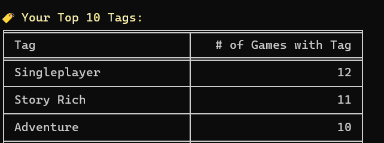
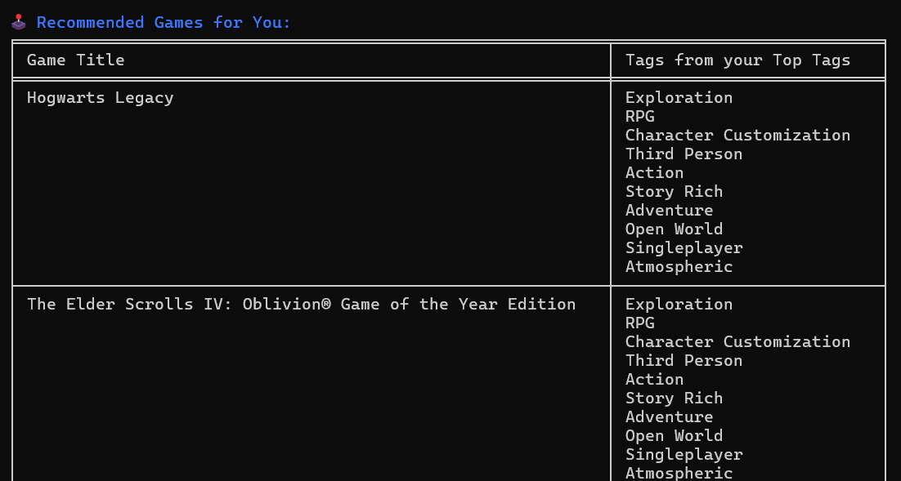
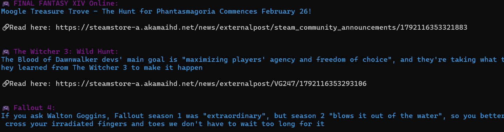

## 🎮 Steam Soup - Your Personal Steam Game Recommender!

**Steam Soup** is a **command-line application** that helps **Steam users analyze their playtime, discover new game recommendations, track their gaming achievements, and fetch news articles about their favorite games**

---

# 🚀 Features
✔ **Fetch Your Steam Library Stats** - View your **most-played games and favorite tags.**  
✔ **Personalized Game Recommendations** - Get **game suggestions** based on your **top-played games and tags.**  
✔ **Track Your Achievements** - See **how much of a game you’ve completed** based on your achievements.  
✔ **Get the Latest News** - Fetch the **latest news articles** about the games you play.  
✔ **Interactive CLI Menu** - Choose from multiple actions with a clean, easy-to-use interface.  
✔ **Steam API Integration** - Fetch **real-time** Steam game data & player statistics.  
✔ **Caching & Performance Optimization** - Store data locally for **faster access.**  

---

# 📦 Installation
### 1️⃣ Clone the Repository
```sh
git clone https://github.com/kbrandt8/steam_soup.git
cd steam_soup
``` 

### 2️⃣ Install Dependencies
```sh
pip install -r requirements.txt
```

### 3️⃣ Set Up Your Steam API Key
- Get a **Steam API Key** here: [🔗 Steam API Registration](https://steamcommunity.com/dev/apikey)  
- Set your **.env:**
```
STEAM_KEY = your_api_here
```
- When you first run `steam_soup.py`, it will **prompt you to enter your API key** if not set.  

---

# 🎮 Usage
Run the app using:  
```sh
python steam_soup.py
```
This launches an **interactive menu** where you can explore your **Steam stats, game recommendations, and news!**  

### 💡 Command Line Options
| Command | Description |
|---------|------------|
| `python steam_soup.py` | Starts the interactive menu. |
| `python cli.py --top-games-tags` | View **most-played games** and **top tags.** |
| `python cli.py --game-recs` | Generate **game recommendations** based on your Steam data. |
| `python cli.py --clear-cache` | Clears **saved data** and fetches new data from Steam. |

---

# 📜 Example Output

### 🎮 Viewing Your Top Tags



### 🔮 Personalized Recommendations



### 📰 Fetching Game News



---

